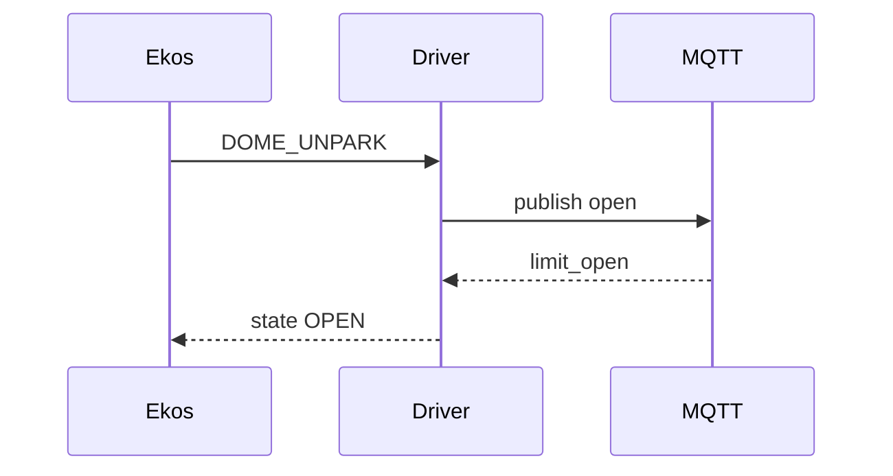
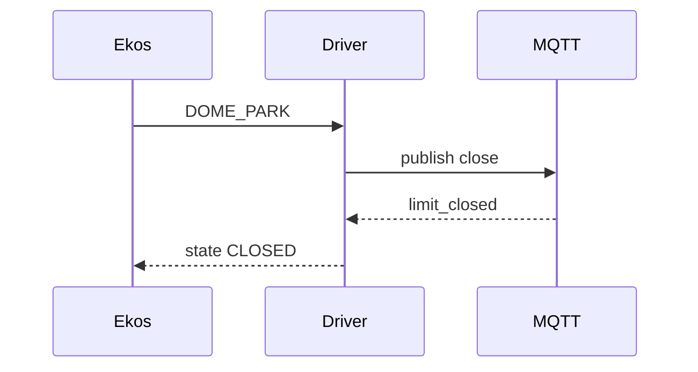
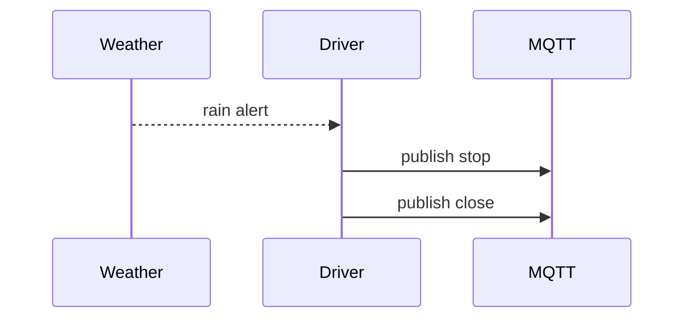

# RORO-MQTT


This project now provides both a small helper library and a production-grade
INDI driver implementing the Universal Roll‑Off‑Roof (ROR) approach.  The
`indi-mqtt-universalror` driver uses MQTT for all I/O and follows the dome
semantics introduced in INDI v2.0.9.

## Clone and Build (Linux)

```bash
git clone https://github.com/smeird/RORO-MQTT.git
cd RORO-MQTT
mkdir build && cd build
cmake ..
make -j
ctest
```


## Features

* Connect to an MQTT broker with optional username/password
* Publish open and close commands
* Optional topics for open/close limit switches
* Optional percentage-open feedback topic
* Optional power control topic

## Usage


```cpp
#include "mqtt_roof_controller.h"
#include "mqtt_client.h"
#include <memory>

int main() {
    auto client = std::make_shared<PahoMqttClient>(
        "tcp://mqtt.example.net:1883", "roof_controller", "user", "secret");
    MQTTRoofController controller(
        client,
        "observatory/roof/open",
        "observatory/roof/close",
        "observatory/roof/open_limit",
        "observatory/roof/close_limit",
        "observatory/roof/percent",
        "observatory/roof/power");

    controller.connect();
    controller.set_power(true);
    controller.open_roof();
}
```

Compile with:

```
g++ -std=c++17 -DPAHO_MQTT src/*.cpp tests/test_driver.cpp \
    -lpaho-mqttpp3 -lpaho-mqtt3as -o example

```

## INDI Driver

The `indi-mqtt-universalror` driver implements the [Universal ROR
specification](https://indilib.org/develop/developer-manual/143-dome.html)
and delegates all physical I/O to MQTT topics.  Limit switches and safety
events are mirrored to standard INDI dome properties.  A simple state machine
guards valid transitions and is unit tested with GoogleTest.

### Configuration

The driver adds an `MQTT_TOPICS` text property in the *Configuration* tab.
Topics for open/close/stop commands and limit switches can be edited and are
stored using the standard INDI configuration mechanism.

### Build

```
mkdir build && cd build
cmake .. && make -j
ctest
```

### Sequence (open)



### Sequence (close)



### Fault Recovery



### Simulation

Run the driver in simulation mode:

```
indiserver -v indi-mqtt-universalror -n
```

### Example Config

See [`config.sample.xml`](config.sample.xml) for a full configuration
including topic mappings and safety policies.
